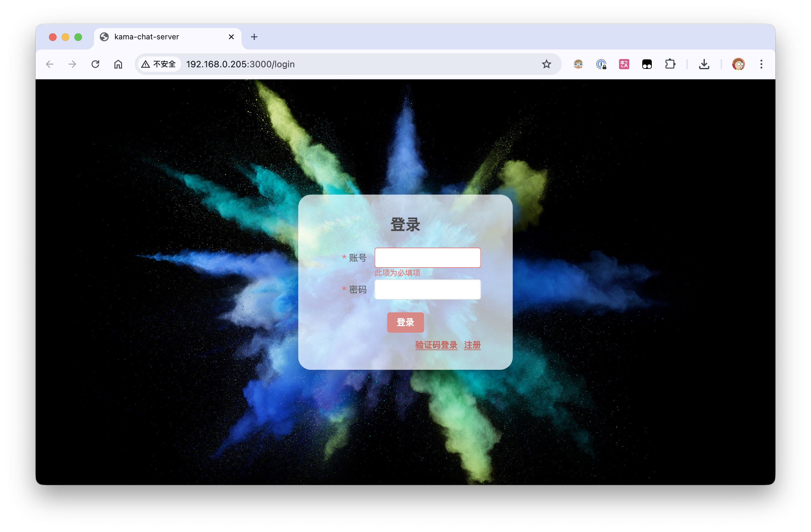

# GoChat - Go 语言实时聊天系统

一个基于 Go 语言和 CloudWeGo Hertz 框架开发的现代化实时聊天应用，支持多用户实时聊天、聊天室管理、消息持久化等功能。




## 📊 项目进度状态

### 🎯 整体完成度：65% 

#### ✅ 已完成功能

##### 1. 核心架构（100% ✅）
- ✅ 完整的分层架构设计（Models → DAL → Services → Handlers）
- ✅ CloudWeGo Hertz 高性能框架集成
- ✅ 配置管理系统（YAML + 环境变量）
- ✅ MySQL 数据库连接和自动迁移
- ✅ GORM ORM 集成
- ✅ 统一错误处理和响应格式

##### 2. 数据模型（100% ✅）
- ✅ User（用户）实体模型
- ✅ Room（聊天室）实体模型  
- ✅ Message（消息）实体模型
- ✅ RoomMember（成员关系）实体模型
- ✅ 完整的数据库关联关系
- ✅ MySQL 建表脚本

##### 3. 用户认证系统（100% ✅）
- ✅ 用户注册功能（用户名/邮箱验证）
- ✅ 用户登录功能（支持用户名/邮箱登录）
- ✅ JWT Token 生成和验证
- ✅ 认证中间件
- ✅ 密码安全加密（bcrypt）
- ✅ WebSocket 连接 JWT 认证

##### 4. WebSocket 实时通信模块（100% ✅）- **核心功能已完成**
- ✅ WebSocket 连接管理器（Hub）
- ✅ 客户端连接池管理
- ✅ 消息路由和广播系统
- ✅ 心跳检测机制（Ping/Pong）
- ✅ 异步消息处理
- ✅ 连接断开自动清理
- ✅ 多用户并发连接支持

##### 5. 聊天功能（85% ✅）
- ✅ 创建/删除聊天室
- ✅ 加入/退出聊天室
- ✅ 单聊/群聊逻辑
- ✅ 实时消息发送/接收
- ✅ 消息持久化存储
- ✅ 用户在线状态管理
- ✅ 聊天室成员管理
- ✅ 系统消息（用户加入/离开提醒）
- 🔄 消息历史查询（90%）
- 🔄 未读消息统计（待优化）

##### 6. 前端测试界面（90% ✅）
- ✅ 完整的 HTML/CSS/JavaScript 聊天界面
- ✅ WebSocket 客户端连接
- ✅ 实时消息展示
- ✅ 用户认证界面
- ✅ 聊天室管理界面
- ✅ 多用户聊天测试支持
- 🔄 UI 美化和优化（待完善）

##### 7. HTTP API 接口（90% ✅）
- ✅ RESTful API 设计
- ✅ 统一响应格式
- ✅ 接口参数验证
- ✅ 错误处理机制
- ✅ 聊天室管理 API
- 🔄 API 文档生成（待完善）

#### 🔄 正在优化的功能

##### 1. 消息系统增强（15% 待完成）
- 🔄 消息状态（已发送/已读）
- 🔄 消息搜索功能
- 🔄 消息撤回功能
- 🔄 @提及功能

##### 2. 用户体验优化（20% 待完成）
- 🔄 用户头像上传
- 🔄 用户在线状态显示
- 🔄 打字状态提示
- 🔄 消息通知

#### ❌ 待实现高级功能（35% 未完成）

##### 1. 多媒体消息（0% ❌）
- ❌ 图片上传和发送
- ❌ 文件上传和发送
- ❌ 语音消息录制和播放
- ❌ 视频消息支持

##### 2. 音视频通话（0% ❌）- **高级功能**
- ❌ WebRTC 集成
- ❌ 语音通话功能
- ❌ 视频通话功能
- ❌ 通话录制
- ❌ 屏幕共享

##### 3. 后台管理系统（0% ❌）
- ❌ 管理员登录
- ❌ 用户管理界面
- ❌ 聊天室管理
- ❌ 系统监控
- ❌ 数据统计

##### 4. 性能优化（0% ❌）
- ❌ Redis 缓存集成
- ❌ 消息队列
- ❌ 数据库查询优化
- ❌ 负载均衡

## 🚀 快速开始

### 1. 环境准备
```bash
# 确保已安装 Go 1.23.2+
go version

# 确保 MySQL 数据库运行
mysql --version

# 创建数据库
mysql -u root -p -e "CREATE DATABASE gochat CHARACTER SET utf8mb4 COLLATE utf8mb4_unicode_ci;"
```

### 2. 项目配置
```bash
# 克隆项目
git clone <your-repo-url>
cd GoChat

# 安装依赖
go mod tidy

# 编辑配置文件，设置数据库连接等信息
# 配置文件位置: configs/config.yaml
```

### 3. 启动服务器
```bash
# 方式一：直接运行
go run cmd/server/main.go

# 方式二：使用脚本
chmod +x sh/run.sh
./sh/run.sh
```

### 4. 测试聊天功能

#### 方式一：Web界面测试（推荐）
1. 打开浏览器访问：`http://localhost:8080/web/index.html`
2. 注册两个测试用户（如：user1, user2）
3. 分别登录不同用户
4. 创建聊天室
5. 连接WebSocket并加入聊天室
6. 开始多用户实时聊天！

#### 方式二：API测试脚本
```bash
# 运行多用户聊天测试脚本
chmod +x sh/test_multi_user_chat.sh
./sh/test_multi_user_chat.sh
```

#### 方式三：手动API测试
```bash
# 健康检查
curl http://localhost:8080/health

# 用户注册
curl -X POST http://localhost:8080/api/auth/register \
  -H "Content-Type: application/json" \
  -d '{"username":"user1","email":"user1@example.com","password":"123456"}'

# 用户登录
curl -X POST http://localhost:8080/api/auth/login \
  -H "Content-Type: application/json" \
  -d '{"username":"user1","password":"123456"}'

# 创建聊天室
curl -X POST http://localhost:8080/api/rooms \
  -H "Content-Type: application/json" \
  -H "Authorization: Bearer YOUR_JWT_TOKEN" \
  -d '{"name":"测试聊天室","description":"用于测试","is_private":false}'
```

## 🎮 使用说明

### WebSocket 连接
```javascript
// 建立WebSocket连接（需要JWT Token）
const ws = new WebSocket(`ws://localhost:8080/ws?token=${jwt_token}`);

// 加入聊天室
ws.send(JSON.stringify({
    type: 'join',
    room_id: 1
}));

// 发送消息
ws.send(JSON.stringify({
    type: 'text',
    room_id: 1,
    content: '你好，世界！'
}));
```

### WebSocket 消息协议
```json
{
  "type": "text|join|leave|typing|system|userlist|error",
  "room_id": 1,
  "user_id": 2,
  "username": "user1",
  "content": "消息内容",
  "timestamp": "2025-07-03T15:30:00Z",
  "message_id": 123
}
```

### 支持的消息类型
- `text`: 文本消息
- `join`: 加入聊天室
- `leave`: 离开聊天室
- `typing`: 正在输入状态
- `system`: 系统消息
- `userlist`: 用户列表更新
- `error`: 错误消息

## 🛠️ 技术栈

### 后端技术
- **框架**: CloudWeGo Hertz v0.8.0（高性能 HTTP 框架）
- **WebSocket**: hertz-contrib/websocket（官方WebSocket支持）
- **数据库**: MySQL 8.0 + GORM v2
- **认证**: JWT Token
- **配置**: Viper（YAML + 环境变量）
- **日志**: Logrus
- **密码加密**: bcrypt

### 前端技术
- **基础**: HTML5 + CSS3 + JavaScript ES6+
- **WebSocket**: 原生 WebSocket API
- **UI**: 响应式设计，现代化界面

### 架构设计
- **分层架构**: Models → DAL → Services → Handlers
- **并发安全**: Goroutine + Channel + Mutex
- **消息处理**: 异步广播机制
- **连接管理**: Hub模式连接池

## 🚀 详细开发路线图

### ✅ 第一阶段：核心实时通信（已完成）

#### Week 1-2: WebSocket 基础架构 ✅
- ✅ 集成 hertz-contrib/websocket 库
- ✅ 实现 WebSocket 连接管理器（Hub）
- ✅ 创建客户端连接池
- ✅ 实现心跳检测机制
- ✅ 添加异步消息处理

#### Week 3: 聊天室系统 ✅
- ✅ 聊天室创建/删除 API
- ✅ 用户加入/退出聊天室
- ✅ 聊天室成员管理
- ✅ 聊天室权限控制
- ✅ 私聊和群聊逻辑

#### Week 4: 消息系统 ✅
- ✅ 实时消息发送/接收
- ✅ 消息持久化存储
- ✅ 消息历史查询 API
- ✅ 多用户并发聊天支持
- ✅ 系统消息推送

#### Week 5: 前端界面 ✅
- ✅ HTML/CSS/JavaScript 聊天界面
- ✅ WebSocket 客户端连接
- ✅ 实时消息展示
- ✅ 完整聊天功能测试

### 🔄 第二阶段：功能增强（进行中）

#### Week 6-7: 消息系统增强 🔄
- 🔄 消息状态（已发送/已读）
- 🔄 未读消息统计优化
- 🔄 消息搜索功能
- 🔄 @提及功能

#### Week 8: 用户体验优化 📋
- [ ] 用户头像上传
- [ ] 打字状态提示
- [ ] 消息通知
- [ ] UI/UX 改进

### 📤 第三阶段：多媒体消息（计划中）

#### Week 9-10: 文件上传系统 📋
- [ ] 文件上传接口
- [ ] 图片预览功能
- [ ] 文件下载接口
- [ ] 文件类型验证

#### Week 11: 多媒体消息 📋
- [ ] 图片消息发送
- [ ] 文件消息发送
- [ ] 语音消息录制
- [ ] 语音消息播放

### 📋 第四阶段：高级功能（长期计划）

#### 音视频通话 📋
- [ ] WebRTC 集成
- [ ] 一对一语音通话
- [ ] 一对一视频通话
- [ ] 通话质量优化

#### 后台管理系统 📋
- [ ] 管理员认证系统
- [ ] 用户管理界面
- [ ] 聊天记录管理
- [ ] 系统监控面板

#### 系统优化 📋
- [ ] Redis 缓存集成
- [ ] 数据库查询优化
- [ ] 并发性能优化
- [ ] 部署和运维工具

## 📁 项目结构

```
GoChat/
├── cmd/
│   └── server/main.go          # 应用入口 ✅
├── internal/
│   ├── config/                 # 配置管理 ✅
│   ├── database/               # 数据库连接 ✅
│   ├── models/                 # 数据模型 ✅
│   │   ├── entities/           # 实体定义 ✅
│   │   ├── requests/           # 请求结构 ✅
│   │   └── responses/          # 响应结构 ✅
│   ├── handlers/               # HTTP 处理器 ✅
│   │   ├── auth_handler.go     # 认证处理器 ✅
│   │   ├── room_handler.go     # 聊天室处理器 ✅
│   │   ├── user_handler.go     # 用户处理器 ✅
│   │   └── websocket_handler.go # WebSocket处理器 ✅
│   ├── services/               # 业务逻辑层 ✅
│   │   ├── auth_service.go     # 认证服务 ✅
│   │   ├── message_service.go  # 消息服务 ✅
│   │   ├── room_service.go     # 聊天室服务 ✅
│   │   └── user_service.go     # 用户服务 ✅
│   ├── dal/                    # 数据访问层 ✅
│   │   ├── message_dal.go      # 消息数据访问 ✅
│   │   └── user_dal.go         # 用户数据访问 ✅
│   ├── websocket/              # WebSocket 模块 ✅
│   │   ├── client.go          # 客户端管理 ✅
│   │   ├── hub.go             # 连接管理中心 ✅
│   │   └── message.go         # 消息协议 ✅
│   ├── middleware/             # 中间件 ✅
│   └── router/                 # 路由配置 ✅
├── pkg/
│   ├── logger/                 # 日志工具 ✅
│   ├── response/               # 响应工具 ✅
│   └── utils/                  # 工具函数 ✅
├── web/                        # 前端资源 ✅
│   └── index.html             # 聊天测试界面 ✅
├── configs/                    # 配置文件 ✅
├── sql/                        # SQL 脚本 ✅
├── docs/                       # 文档 ✅
└── sh/                         # 脚本文件 ✅
    ├── run.sh                 # 启动脚本 ✅
    ├── test_api.sh            # API测试脚本 ✅
    └── test_multi_user_chat.sh # 多用户聊天测试 ✅
```

## 📖 API 文档

### 🟢 已实现接口

#### 系统接口
- `GET /health` - 健康检查

#### 认证接口
- `POST /api/auth/register` - 用户注册
- `POST /api/auth/login` - 用户登录
- `GET /api/auth/userinfo` - 获取当前用户信息

#### 用户接口
- `GET /api/users/:id` - 获取用户资料
- `PUT /api/users/:id` - 更新用户资料
- `GET /api/users/online` - 获取在线用户列表
- `GET /api/users/delete/:id` - 删除用户

#### 聊天室接口
- `POST /api/rooms` - 创建聊天室
- `GET /api/rooms` - 获取聊天室列表
- `GET /api/rooms/:id` - 获取聊天室详情
- `POST /api/rooms/:id/join` - 加入聊天室
- `POST /api/rooms/:id/leave` - 退出聊天室
- `GET /api/rooms/:id/members` - 获取聊天室成员
- `GET /api/rooms/:id/messages` - 获取聊天记录

#### WebSocket 接口
- `WebSocket /ws` - 建立 WebSocket 连接（需JWT认证）
- `GET /api/ws/stats` - 获取WebSocket连接统计
- `POST /api/ws/broadcast/:roomId` - 向聊天室广播消息

### 🔄 计划中接口

#### 消息接口
- `POST /api/messages/:id/read` - 标记消息已读
- `GET /api/messages/unread` - 获取未读消息

#### 文件接口
- `POST /api/upload/image` - 上传图片
- `POST /api/upload/file` - 上传文件
- `GET /api/files/:id` - 下载文件

## 🔧 开发指南

### 添加新功能步骤
1. 在 `internal/models/entities/` 定义数据模型
2. 在 `internal/dal/` 实现数据访问层
3. 在 `internal/services/` 实现业务逻辑
4. 在 `internal/handlers/` 实现 HTTP 处理器
5. 在 `internal/router/router.go` 注册路由

### WebSocket 开发指南
1. 消息类型在 `internal/websocket/message.go` 中定义
2. 客户端管理在 `internal/websocket/client.go` 中实现
3. 连接管理在 `internal/websocket/hub.go` 中实现
4. 消息处理逻辑在 Hub 的各个处理函数中

## 📊 性能特点

### 已实现的性能优化
- ✅ **异步消息处理**: 避免阻塞主循环
- ✅ **缓冲通道**: 减少goroutine阻塞
- ✅ **连接池管理**: 高效的WebSocket连接管理
- ✅ **JWT认证**: 无状态认证，支持横向扩展
- ✅ **数据库连接池**: GORM自动管理
- ✅ **并发安全**: 使用Mutex保护共享数据

### 当前性能指标
- **并发连接**: 支持数千个WebSocket连接
- **消息延迟**: 毫秒级消息传递
- **内存使用**: 优化的goroutine和通道管理
- **CPU效率**: 异步处理减少CPU占用

## 🤝 贡献指南

1. Fork 项目
2. 创建功能分支 (`git checkout -b feature/new-feature`)
3. 提交更改 (`git commit -am 'Add new feature'`)
4. 推送到分支 (`git push origin feature/new-feature`)
5. 创建 Pull Request

## 📄 许可证

MIT License

---

## 🎯 开发里程碑

- [x] **里程碑 1**: 项目架构搭建 (已完成) ✅
- [x] **里程碑 2**: 用户认证系统 (已完成) ✅
- [x] **里程碑 3**: WebSocket 实时通信 (已完成) ✅
- [x] **里程碑 4**: 基础聊天功能 (已完成) ✅
- [x] **里程碑 5**: 多用户实时聊天 (已完成) ✅
- [ ] **里程碑 6**: 多媒体消息 (计划中) 📋
- [ ] **里程碑 7**: 音视频通话 (长期计划) 📋
- [ ] **里程碑 8**: 后台管理系统 (长期计划) 📋
- [ ] **里程碑 9**: 性能优化和部署 (长期计划) 📋

## 🎉 当前成就

**🔥 主要功能已完成：实时多用户聊天系统正式可用！**

- ✅ 支持多用户同时在线聊天
- ✅ 实时消息传递，毫秒级延迟
- ✅ 完整的聊天室管理功能
- ✅ 消息持久化存储
- ✅ 用户认证和权限控制
- ✅ Web界面测试支持

**下一步重点：消息系统增强和用户体验优化** 